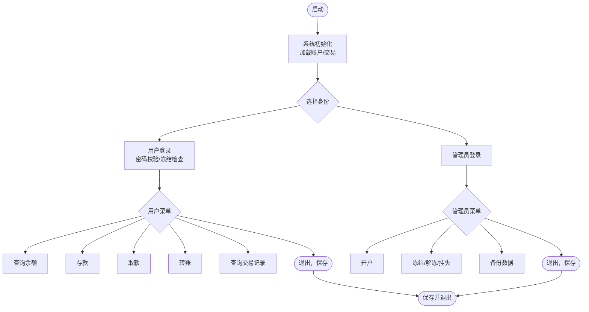
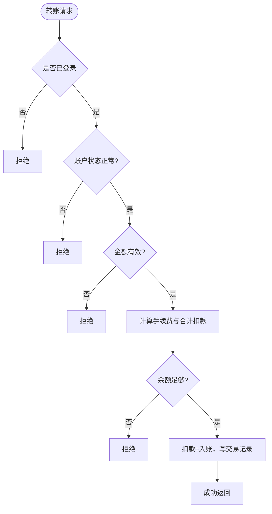
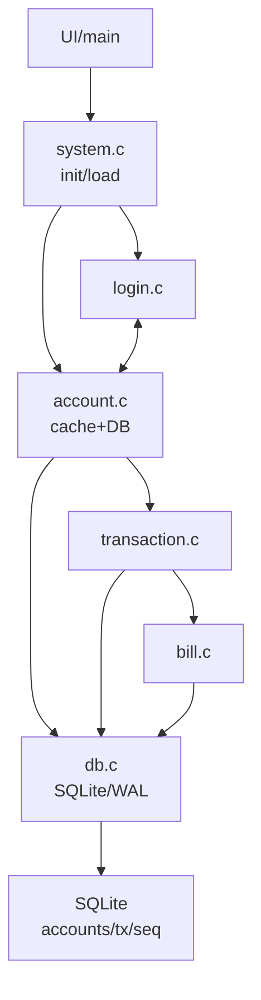

# BankMiniSys

小型银行账户管理系统

模拟银行核心业务流程，支持账户开户、存取款、转账、账单查询、密码管理等功能。

## 功能模块

- **账户管理模块**：负责开户 / 销户、账户信息修改
- **交易模块**：处理存款、取款、转账
- **账单模块**：生成交易流水记录、按时间 / 类型查询账单、导出账单文件
- **安全模块**：实现密码加密（简易 MD5 / 哈希）、挂失 / 解挂、登录锁定
- **系统管理模块**：管理员功能（账户冻结 / 解冻）、数据备份 / 恢复

---

## 分工

### 成员 1：账户管理模块

- 核心任务：开户（生成账号、录入基本信息）、销户（验证账户状态 / 余额）、账户信息查询（按账号查余额 / 信息）
- 辅助：账户数据的文件读写（仅保留基本存储）

### 成员 2：交易模块

- 核心任务：存款（余额增加）、取款（余额校验 + 扣除）、转账（转出 / 转入账户余额同步）
- 辅助：转账手续费计算（固定比例）

### 成员 3：账单模块

- 核心任务：生成交易记录（存取款 / 转账日志）、按账号查询交易记录
- 辅助：简单的交易记录展示（无需导出功能）

### 成员 4：安全模块

- 核心任务：密码加密（简易哈希）、登录验证（密码校验 + 失败锁定）
- 辅助：账户挂失状态标记（挂失后禁止交易）

### 成员 5：系统管理模块

- 核心任务：账户冻结 / 解冻、数据一键备份（复制数据文件）
- 辅助：系统初始化（启动时加载数据）

---

## 流程图



---



---

## 编译与运行

```bash
gcc -std=c11 -Wall -Wextra -O2 main.c account.c login.c md5.c render.c system.c transaction.c bill.c global.c db.c sqlite3.c -o BankMiniSys.exe
```


## 架构图


